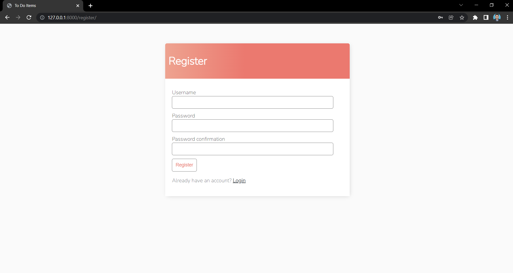
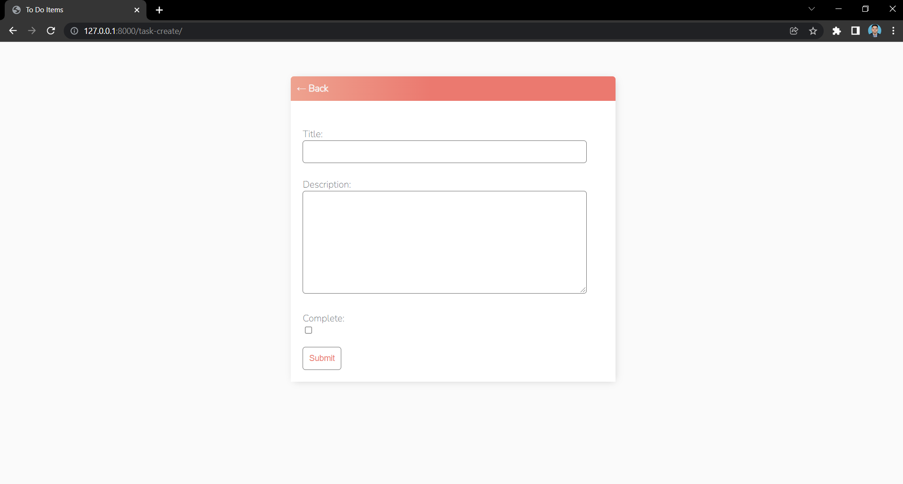

# Django-ToDo
To Do app with User Registration, Login, Search and full Create Read Update and DELETE functionality.

# Steps to run

1. Install python version 3.8
2. In the project directory, you can run: 
    pip install django=3.0.8
4. python manage.py runserver
5. Open http://127.0.0.1:8000/ in browser

# Project ScreenShots

